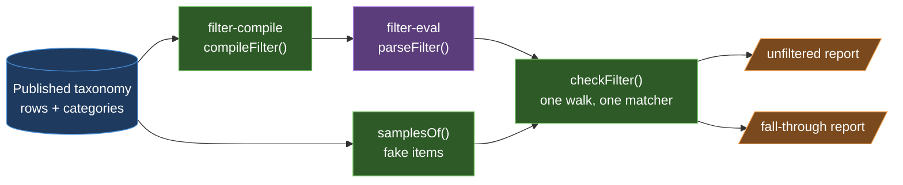
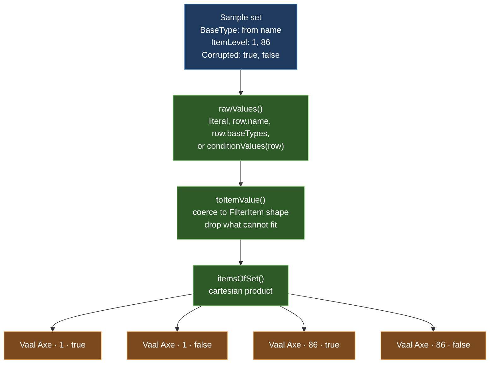
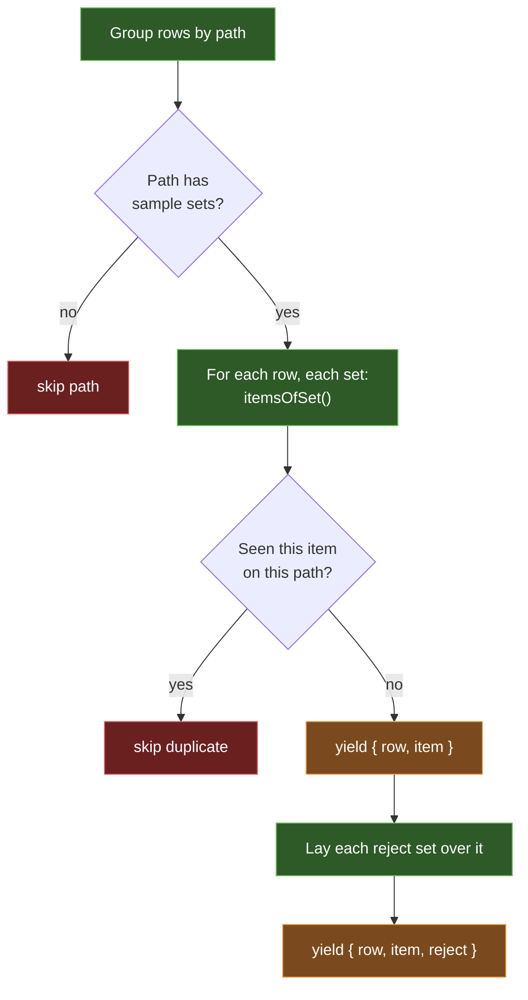
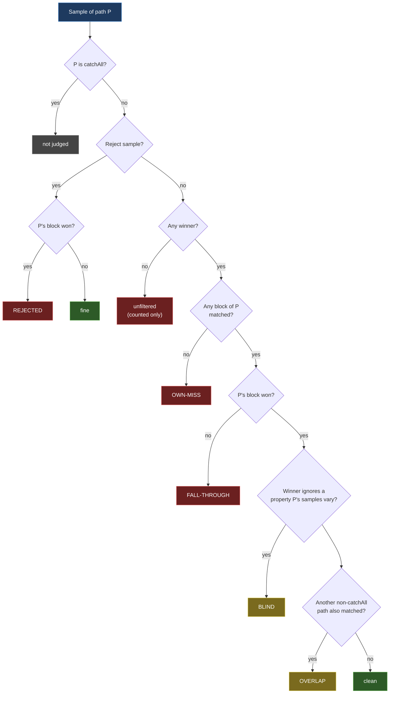
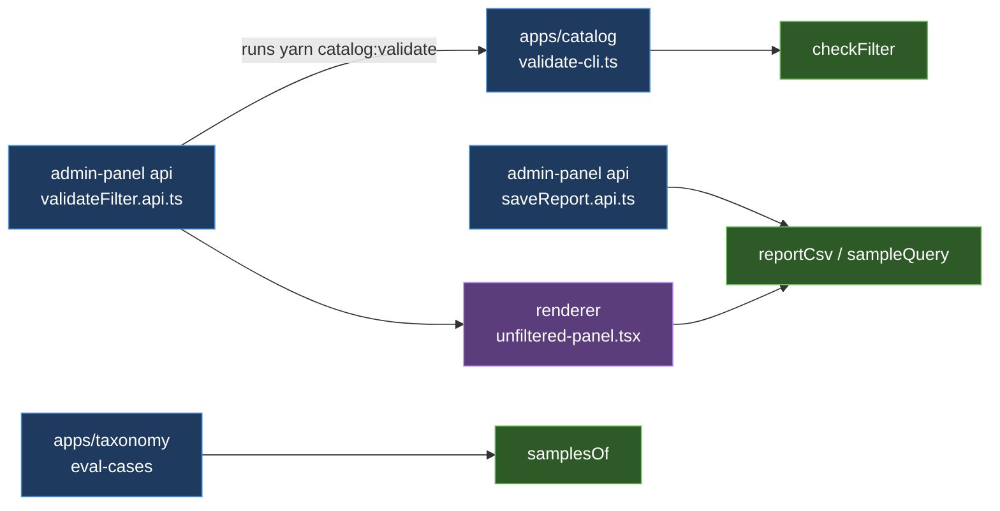

# Sample generation and the blind-spot checker

`@poe/filter-validate` answers one question: **does the compiled `.filter` put every item where the taxonomy says it belongs?**

It cannot ask the game. So it builds fake items ("samples") from rules the taxonomy authors, runs them through `@poe/filter-eval`, and reports where they land.

## The big picture



Two inputs come from the same taxonomy: the **filter** (what the rows say as `.filter` lines) and the **samples** (what the subcategories say items look like). The checkers compare the two.

## Part 1: building samples

### Where the rules live

A subcategory record in the taxonomy can carry:

| Field | Meaning |
| --- | --- |
| `samples` | A list of **sample sets**. Each set is `{ ConditionName: property }`. |
| `rejects` | Sets laid **over** each sample. Their own path must *not* take the result. |
| `catchAll` | This path is a fallback. It may overlap its siblings. |

A property is either literal values or a pointer to the row:

```jsonc
{
  "BaseType":  { "from": "name" },          // the row's name
  "ItemLevel": { "values": [1, 68, 86] },   // three literal values
  "Rarity":    { "from": "conditions" }     // whatever the row's conditions hold
}
```

Top-level categories hold no samples. Only `category/subcategory` paths do.

### How one set becomes items

Each set expands to the **cartesian product** of its properties.



- `from: "conditions"` calls `conditionValues`, which runs `resolveForms` from `@poe/filter-compile`. It collects every value the row and its variants hold for that condition. It runs lazily, once per row.
- A property with no usable values is **dropped**, not an error. The product just gets smaller.
- Unknown condition names are skipped silently.

### The generator: `samplesOf`



- It is a generator. Samples stream one at a time, so a large taxonomy does not sit in memory.
- A duplicate item on one path goes to the **first** row that built it. Later rows never see it.
- Reject samples carry `reject`: the JSON of the override, used later as a label.

## Part 2: the checkers

`checkFilter` compiles the matcher once with `compileFilterEvery` and walks the samples once. Each sample is matched once, and that one result feeds both reports. `findUnfiltered` and `findFallThrough` are one-line wrappers that return one half each.

### Unfiltered: did anything take it?

The simple one. For each normal sample, ask the compiled filter for a winner. No winner means the item falls off the end of the filter and the game shows it with default styling.

- A `Hide` block **counts as taking** the item.
- Reject samples are ignored here.
- It also lists `unsampled`: paths that have rows but no sample sets, so nobody checks them.

### Fall-through: did the *right* thing take it?

This is the blind-spot checker. It reads the same match result, which holds the winner **and** every other block that matched. Each question has its own judge in `find-fall-through/`: `judgeReject`, `judgePlacement`, `blindsOf` and `overlapsOf`.

Every block's note names the row that wrote it (`#@ <key> <variant>`). `ownerOf` reads that key back, so a block can be traced to a row, and a row to a path.



Blind and overlap are **not** exclusive. One sample can report both.

### What each bucket means in plain words

| Bucket | Meaning | Usual fix |
| --- | --- | --- |
| **own-miss** | No block from the item's own path matched it at all. | The path's conditions are too narrow for this sampled state. Add a rule. |
| **fall-through** | Its own path matched, but an earlier block from another path won. | Block order, or the other path is too broad. |
| **overlap** | Its own path won, but another path also matched. Harmless today, a trap after reordering. | Tighten one of the two. |
| **blind** | The samples vary a property (e.g. `Corrupted: true/false`), but the winning block never asks about it. Both states land in the same block. | Add a variant that splits on that property, or stop varying it. |
| **rejected** | A reject sample (an item the path must never take) was taken by the path. | The path's conditions miss an exclusion. |

### Grouping

Raw hits are tallied by `(own path, other path)`, `(path, property)` or `(path, reject)`. Each group keeps one example item and a count, sorted by count. That is what makes the report readable.

## Who calls it



The panel runs the CLI in a throwaway lake and reads the JSON file back. Its Filter check dialog shows the unfiltered groups first, then one section per fall-through bucket. The CSV export holds the unfiltered half only.

## Structure review

**Verdict: the sample generation is well built. The checker is now one walk with small judges.**

Good:
- `samplesOf` and its helpers are small, pure and each testable alone. One job per file.
- Samples stream through a generator. The lib reads no files and no environment.
- Which samples exist lives in the taxonomy, not in code.
- `conditionValues` reuses `filter-compile`'s `resolveForms`, so samples and the compiled filter cannot disagree about a row's conditions.

Problems, most important first:
1. **Hidden string contract.** `ownerOf` parses the block note by splitting on a space. That format belongs to `filter-compile`/`format-note`, and nothing ties the two together except convention.
2. **Small duplication.** `group-unfiltered.ts` re-implements `pathOf`. `report-csv.ts`'s `cellValue` copies `describe-sample.ts`'s `describeValue`.
3. **Silent drops.** An unknown condition name in a sample set, or a value of the wrong type, just disappears. A typo in the taxonomy yields fewer samples, not an error.
