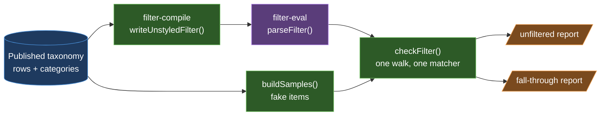
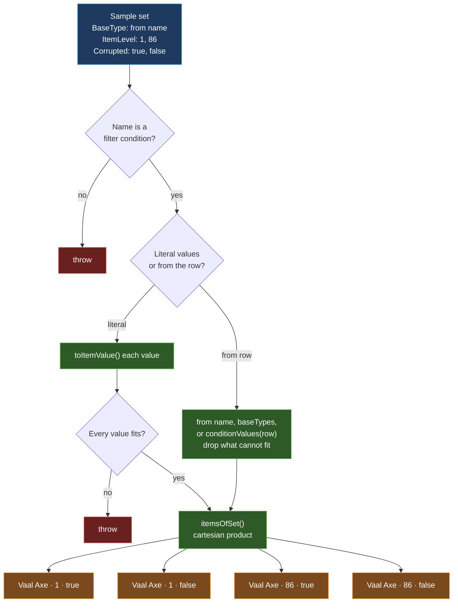
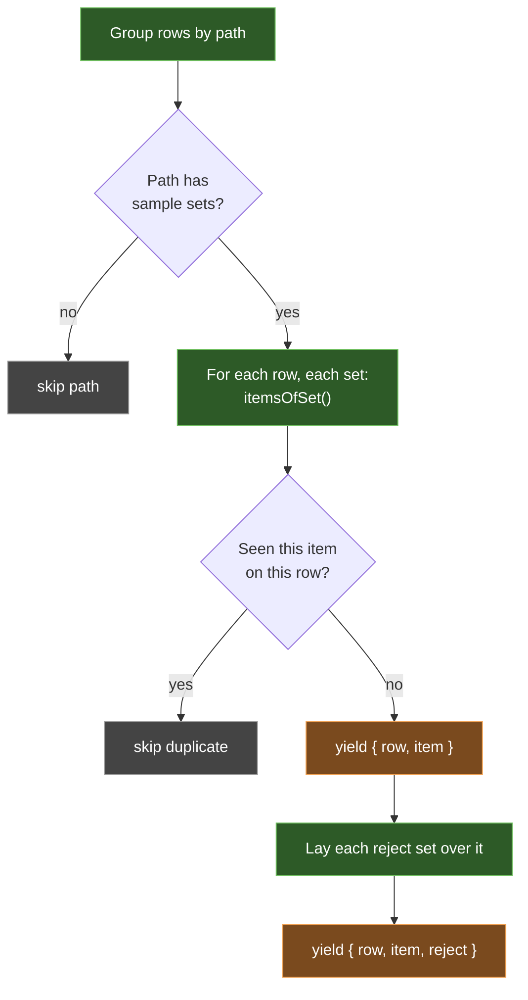
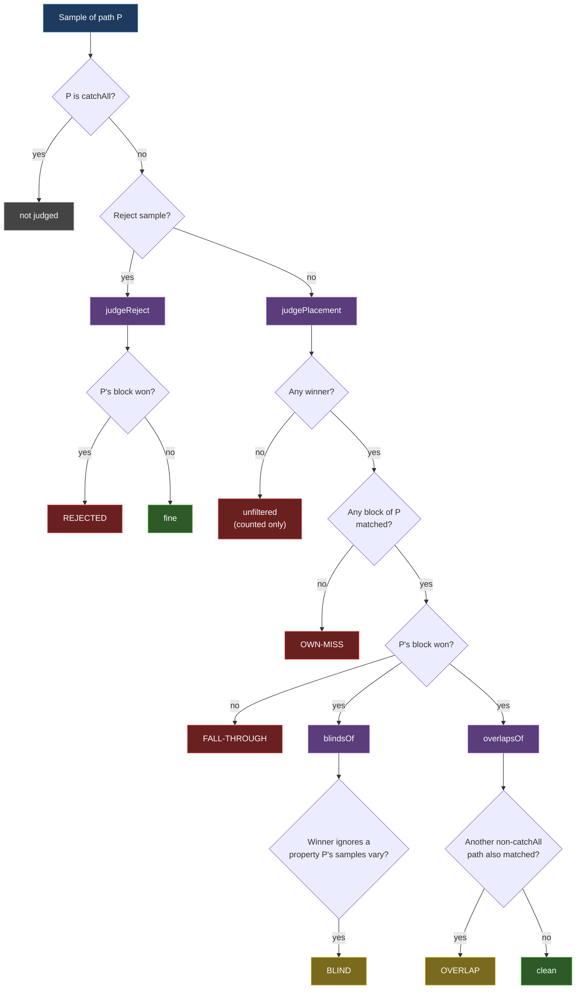
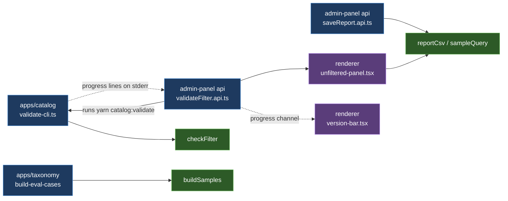

# Sample generation and the filter check

`@poe/filter-validate` answers one question: **does the compiled `.filter` put every item where the taxonomy says it belongs?**

It cannot ask the game. So it builds fake items ("samples") from rules the taxonomy authors, runs each one through `@poe/filter-eval` once, and reports where it landed.

## The big picture



Two things come out of the same taxonomy:

- The **filter** is what the rows say, written as `.filter` lines.
- The **samples** are what the subcategories say items look like.

`checkFilter` compares the two.

## Part 1: building samples

### Where the rules live

A subcategory record in the taxonomy can carry:

| Field      | Meaning                                                                    |
| ---------- | -------------------------------------------------------------------------- |
| `samples`  | A list of **sample sets**. Each set is `{ ConditionName: property }`.      |
| `rejects`  | Sets laid **over** each sample. Their own path must _not_ take the result. |
| `catchAll` | This path is a fallback. It may overlap its siblings.                      |

A property is either literal values or a pointer to the row:

```jsonc
{
  "BaseType": { "from": "name" }, // the row's name
  "ItemLevel": { "values": [1, 68, 86] }, // three literal values
  "Rarity": { "from": "conditions" }, // whatever the row's conditions hold
}
```

Top-level categories hold no samples. Only `category/subcategory` paths do.

### How one set becomes items

Each set expands to the **cartesian product** of its properties.



- **A typo fails loudly.** An unknown condition name throws. So does a literal value that cannot fit its condition, like `Quality: "bad"`.
- **Row values are forgiving on purpose.** A property read off the row with no usable values is left out, so the product just gets smaller. A row simply may not hold that condition.
- `from: "conditions"` calls `conditionValues`, which runs `resolveForms` from `@poe/filter-compile`. It collects every value the row and its variants hold for that condition. It runs lazily, once per row.

### The generator: `buildSamples`



- It's a generator, so samples stream one at a time and the whole set never sits in memory.
- An item is deduplicated per **row**. Two rows that build the same item each yield it, so a caller can see the overlap.
- Reject samples carry `reject`, which is the JSON of the override. It's used later as a label.

## Part 2: the check

### One walk, one matcher

`checkFilter` builds one matcher over the blocks with `buildEveryMatchMatcher`, which returns the winner **and** every other block that matched. Then it walks `buildSamples` once, skipping an item another row on the same path already built. Each sample is matched once, and that one result feeds both reports.

`findUnfiltered` and `findFallThrough` are one-line wrappers that return one half each.

### Which row owns a block

Every block ends with a `#@` note whose freehand is `<key>` or `<key> <variant>`. `@poe/filter-compile/owner-note` owns that format:

- `writeOwnerNote(key, variant?)` writes it. `writeUnstyledFilter` and `@poe/filter-style`'s `writeFilter` both use it.
- `readOwnerNote(freehand, isKey)` reads it back. Keys may hold spaces, so it takes the **longest known key** the note starts with.

That's how a matched block is traced back to a row, and a row to a path.

### Unfiltered: did anything take it?

For each normal sample, ask whether any block won.

- No winner means the item falls off the end of the filter, and the game shows it with default styling.
- A `Hide` block **counts as taking** the item.
- Reject samples are ignored here. Catch-all samples are included.

It also lists `unsampled`: paths that have rows but no sample sets, so nobody checks them.

### Fall-through: did the _right_ thing take it?

This is the blind-spot checker. Each question has its own judge in `find-fall-through/`.



Blind and overlap are **not** exclusive. One sample can report both.

### What each bucket means in plain words

| Bucket           | Meaning                                                                                                                                    | Usual fix                                                                |
| ---------------- | ------------------------------------------------------------------------------------------------------------------------------------------ | ------------------------------------------------------------------------ |
| **own-miss**     | No block from the item's own path matched it at all.                                                                                       | The path's conditions are too narrow for this sampled state. Add a rule. |
| **fall-through** | Its own path matched, but an earlier block from another path won.                                                                          | Block order, or the other path is too broad.                             |
| **overlap**      | Its own path won, but another path also matched. Harmless today, a trap after reordering.                                                  | Tighten one of the two.                                                  |
| **blind**        | The samples vary a property (e.g. `Corrupted: true/false`), but the winning block never asks about it. Both states land in the same block. | Add a variant that splits on that property, or stop varying it.          |
| **rejected**     | A reject sample (an item the path must never take) was taken by the path.                                                                  | The path's conditions miss an exclusion.                                 |

### Grouping

`tally.ts` groups the raw hits by `(own path, other path)`, `(path, property)` or `(path, reject)`. Each group keeps one example item and a count, and groups are sorted by count. That's what keeps the report readable.

## Who calls it



The panel runs the CLI in a throwaway lake. While it runs, the CLI writes `progress n/4 label` lines to stderr. The panel streams them to the version bar as a progress bar and a step label.

When the run ends, the panel reads the JSON file back. Its Filter check dialog shows the unfiltered groups first, then one section per fall-through bucket. The CSV export holds the unfiltered half only.

## Structure review

**Verdict: both halves are in good shape.** Sample generation was already clean. The check is now one walk with one small judge per question.

What holds it together:

- `buildSamples` and its helpers are small and pure, and each one can be tested alone.
- Samples stream through a generator, and the lib reads no files and no environment.
- Which samples exist lives in the taxonomy, not in code.
- `conditionValues` reuses `filter-compile`'s `resolveForms`, so samples and the compiled filter cannot disagree about a row's conditions.
- The block note has one writer and one reader, both in `filter-compile`.
- A typo in a sample set throws instead of quietly shrinking the check.

Nothing from the earlier review is still open.
